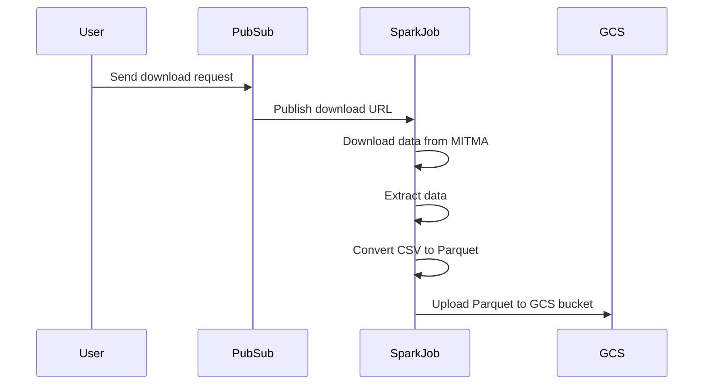

# Data Load Process

This document describes the sequence of events to download data from MITMA and upload it to a GCS bucket as Parquet files.

### Sequence Diagram


Steps in Detail

    User Sends Download Request:
        The user sends a request to download data from MITMA by publishing a message to a Pub/Sub topic.

    Publish Download URL to SparkJob:
        The Pub/Sub service receives the URL and triggers the Spark job by publishing the message to a subscription that the Spark job listens to.

    Download Data from MITMA:
        The Spark job downloads the data from the provided MITMA URL.

    Extract Data:
        If the downloaded data is in a compressed format (e.g., tar file), the Spark job extracts the data.

    Convert CSV to Parquet:
        The Spark job reads the CSV data and converts it into Parquet format for optimized storage and querying.

    Upload Parquet to GCS Bucket:
        Finally, the Spark job uploads the Parquet file to the specified GCS bucket.

This sequence ensures a smooth and automated process for handling data from MITMA and storing it efficiently in GCS.

# Initial Steps for Loading Data from MITMA to GCS Bucket

This document provides a step-by-step guide to the initial setup and loading process for transferring data from MITMA to a Google Cloud Storage (GCS) bucket. Follow these steps carefully to ensure a smooth setup and deployment.

## Steps Overview

1. **Initializing the Environment** (`00_setup.sh`)
2. **Installing Dependencies** (`01_install_dependencies.sh`)
3. **Creating Service Account** (`02_create_service_account.sh`)
4. **Loading Google Credentials** (`03_load_google_creds.sh`)
5. **Checking GCS Bucket** (`04_check_gcs_bucket.sh`)
6. **Testing Terraform Deployment** (`test/tf_test.go`)
7. **Deploying Terraform** (`05_deploy_tf.sh`)

## Step-by-Step Instructions

### 1. Initializing the Environment - `00_setup.sh`

This script sets up the necessary environment variables. You need to source this script instead of running it directly.

**Run:**
```sh
source ./00_setup.sh
```

### 2. Installing Dependencies - `01_install_dependencies.sh`

Run this script to install all necessary dependencies, including terraform, docker, go, and other required packages.

**Run**:
```sh
./01_install_dependencies.sh
```

### 3. Creating Service Account - `02_create_service_account.sh`

This script creates a Google Service Account and must be run in a non-managed IDE (not Replit) because it requires online authentication to Google, and these environments often do not open ports that are easily accessible.

**Run**:
```sh
source ./02_create_service_account.sh
```

### 4. Loading Google Credentials - `03_load_google_creds.sh`

Source this script to load the necessary Google credentials for your environment.

**Run**:
```sh
source ./03_load_google_creds.sh
```

### 5. Checking GCS Bucket - `04_check_gcs_bucket.sh`

This script checks the existence and accessibility of the GCS bucket. It can be run as a normal script, and it might be a good idea to move it to the test/ directory for better organization.

**Run**:
```sh
./04_check_gcs_bucket.sh
```

### 6. Testing Terraform Deployment - `test/tf_test.go`

Before running the final deployment, it is crucial to test it using Go to ensure that your Terraform configuration is correct.

Steps to Set Up and Initialize the Go Project:

i. Navigate to the Test Directory:
  ```sh
  cd ./load/test
  ```
ii. Initialize a Go Module:
  ```sh
  go mod init mobi-cat
  ```
iii. Add Dependencies:
  ```sh
  go get github.com/gruntwork-io/terratest/modules/terraform
  go get github.com/stretchr/testify
  ```
iv. Run the Tests:
  ```sh
  go test -v
  ```

### 7. Deploying Terraform - `05_deploy_tf.sh`

After successfully testing with Go, you can run the final deployment.

Note: Ensure that all previous setup and test steps have been followed correctly.

**Run**:
```sh
./05_deploy_tf.sh
```
Remaining Steps

Further steps are under development and documentation will be added shortly.