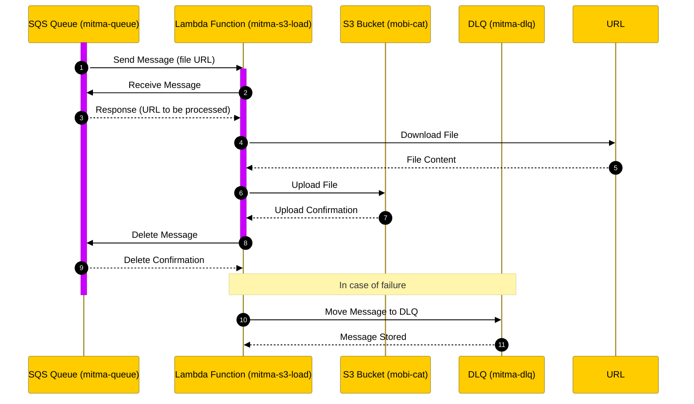

# Mobi-Cat AWS Lambda S3 Load System

## Overview

This project sets up an AWS Lambda function to process files from a URL, downloads them, and uploads them to an S3 bucket. The system is designed to be scalable, efficient, and cost-effective by using AWS services like S3, SQS, and Lambda.

### Source of URLs and Files
- The file URLs come from the RSS feed available [here](https://movilidad-opendata.mitma.es/RSS.xml).
- The files themselves are part of a mobility study project located at [Opendata Movilidad](https://www.transportes.gob.es/ministerio/proyectos-singulares/estudios-de-movilidad-con-big-data/opendata-movilidad).

## Architecture


### Components:
- **Lambda Function**: Processes each URL, downloads the file, and uploads it to S3.
- **SQS Queue**: Handles message queuing for URLs to be processed by the Lambda function.
- **DLQ (Dead-Letter Queue)**: Captures messages that failed processing after a number of attempts.
- **S3 Bucket**: Stores the downloaded files.

## Sequence Diagram
Here is the sequence diagram that illustrates the download and upload flow:



## Setup Instructions

### Prerequisites
- AWS CLI installed and configured
- Terraform installed
- Python 3.8+ installed
- pip installed

### Creating the Environment
1. Clone the Repository
```shell
git clone https://github.com/lunasilvestre/mobi-cat.git
cd mobi-cat/aws-load
```
2. Install Python Dependencies
```shell
pip install -r requirements.txt
```
3. Configure Environment Variables
Create a copy of `.env.sample` and rename it to `.env`. Populate it with your AWS environment variables.
```shell
AWS_REGION=eu-south-2
LAMBDA_FUNCTION_NAME=mitma-s3-load
MAIN_QUEUE_NAME=mitma-queue
DLQ_NAME=mitma-dlq
S3_BUCKET_NAME=mobi-cat
S3_KEY_PREFIX=mitma/raw
```
4. Package Lambda Function
```shell
./package.sh
```
5. Deploy with Terraform
```shell
./deploy.sh
```
6. Run Tests
```shell
python -m unittest test_lambda_function.py
```
## Operational Guidelines
### Monitoring
- Use AWS CloudWatch logs to monitor the Lambda function's execution information, errors, and debugging.
- SQS queues should be monitored for any stuck messages, indicating issues in message processing.
### Scaling
- The Lambda function scales automatically based on the number of messages in the SQS queue.
- Ensure the Lambda concurrency limits are configured as per your application's throughput requirements.
