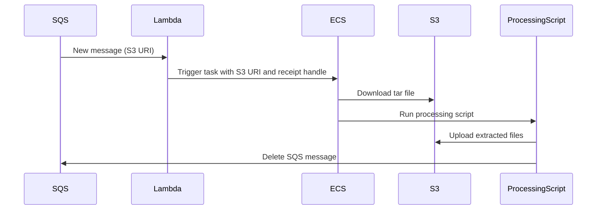
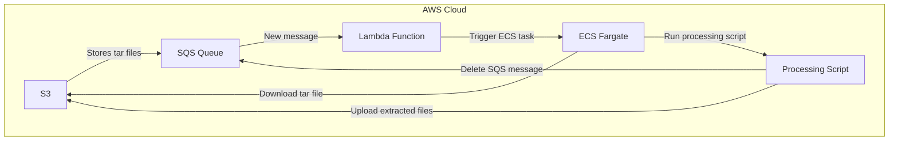

# Tar File Processing Architecture

This document outlines the architecture and job flow for processing tar files stored in S3 using AWS services. The setup ensures efficient resource utilization, cost control, and scalability by leveraging AWS Lambda, SQS, ECS, and Fargate.

## Architecture Overview

1. **SQS Queue**: Holds messages with S3 URIs of tar files.
2. **AWS Lambda**: Acts as an intermediary to trigger ECS tasks when new messages arrive in the SQS queue.
3. **ECS Fargate Task**: Processes the tar files and deletes the SQS message upon successful processing.

## Components

### SQS Queue
- **Purpose**: To store messages containing the S3 URIs of the tar files to be processed.
- **Setup**: Create a standard SQS queue using the AWS Management Console.

### Lambda Function
- **Purpose**: To trigger ECS tasks based on the messages in the SQS queue.
- **Environment Variables**:
  - `ECS_CLUSTER_NAME`: Name of the ECS cluster.
  - `ECS_TASK_DEFINITION`: Name of the ECS task definition.
  - `SUBNET_ID`: ID of the subnet in the VPC.
  - `SECURITY_GROUP_ID`: ID of the security group in the VPC.

Refer to the [lambda_function.py](lambda_function.py) file for the Lambda function code.

### ECS Fargate Task
- **Purpose**: To process the tar files and delete the SQS message upon successful processing.
- **Task Definition**: Configure the task definition with the necessary container image, environment variables, and network settings.

Refer to the [ecs_task_definition.json](ecs_task_definition.json) file for the ECS task definition.

### ECS Task Script
- **Purpose**: To download, extract, and upload the contents of the tar files, and then delete the message from the SQS queue.
- **Script**:

Refer to the [ecs_task.py](ecs_task.py) file for the ECS task script.

## Job Flow

1. **Message Arrival**:
   - An S3 URI is posted to the SQS queue.

2. **Lambda Function**:
   - The Lambda function is triggered by the SQS event.
   - Reads the message from the SQS queue.
   - Extracts the S3 URI and receipt handle.
   - Triggers an ECS task with the S3 URI and receipt handle as environment variables.

3. **ECS Task**:
   - The ECS task runs the Docker container with the Python script.
   - The Python script downloads and processes the tar file.
   - If processing is successful, the script deletes the message from the SQS queue using the receipt handle.
   - The ECS task stops after processing is complete.

## Diagrams

### Sequence Diagram

### Architecture Diagram

